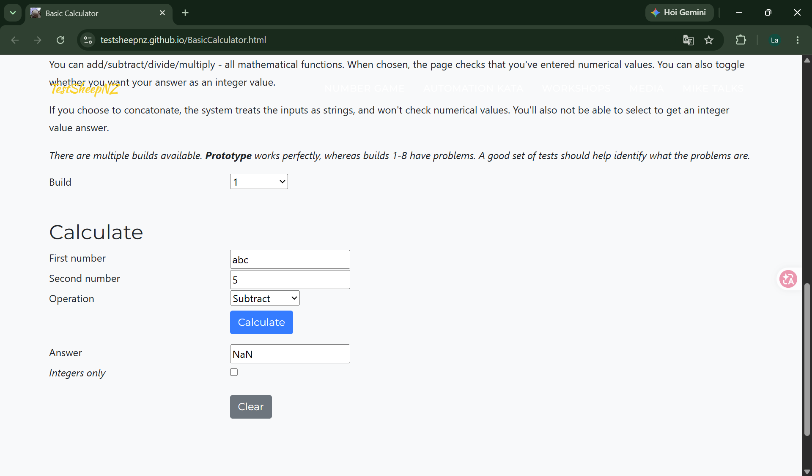
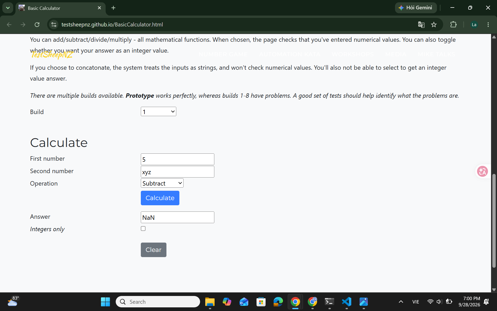

# [BUG][Subtraction][Build 1] Non-numeric operands produce NaN instead of validation errors

## GitHub Issue
[#2](https://github.com/Notistris/Ktpm-cs10003-week03/issues/2)

## Found by Test Case
- TC-SUB-009
- TC-SUB-010

## Requirement liên quan
FR-SUB-03

## Severity / Priority
Major / P1

## Environment
- Browser: Google Chrome 153.0.8010.53
- OS: Windows 11 (10.0.26100.0)
- URL: https://testsheepnz.github.io/BasicCalculator.html
- Calculator build: 1
- Test repository commit: `9f671d7`

## Steps to reproduce
1. Open the Basic Calculator page
2. Select Build `1`
3. Enter `abc` in **First number** and `5` in **Second number**
4. Select `Subtract`
5. Click **Calculate**
6. Repeat with `5` in **First number** and `xyz` in **Second number**

## Expected result
The calculator rejects the non-numeric operand and displays `Number 1 is not a number` or `Number 2 is not a number` for the corresponding field. No answer is produced.

## Actual result
The calculator accepts the non-numeric operand and displays `NaN` in the **Answer** field without a validation error.

## Evidence
- [Build 1 test-run report](../../test-runs/subtraction/subtraction-build-1-test-run.md)
- TC-SUB-009 actual result: `Answer: NaN`
- TC-SUB-010 actual result: `Answer: NaN`

### Screenshots

TC-SUB-009 — invalid First number produces `NaN`:

TC-SUB-010 — invalid Second number produces `NaN`:

