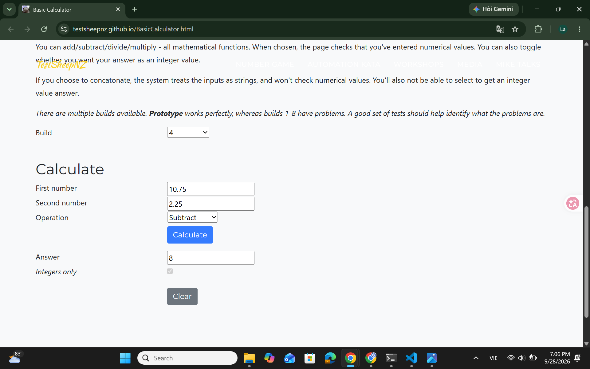

# [BUG][Subtraction][Build 4] Decimal result is forced to an integer when Integers only is unchecked

## GitHub Issue
[#3](https://github.com/Notistris/Ktpm-cs10003-week03/issues/3)

## Found by Test Case
- TC-SUB-007

## Requirement liên quan
FR-SUB-01

## Severity / Priority
Major / P1

## Environment
- Browser: Google Chrome 153.0.8010.53
- OS: Windows 11 (10.0.26100.0)
- URL: https://testsheepnz.github.io/BasicCalculator.html
- Calculator build: 4
- Test repository commit: `9f671d7`

## Steps to reproduce
1. Open the Basic Calculator page
2. Select Build `4`
3. Enter `10.75` in **First number**
4. Enter `2.25` in **Second number**
5. Select `Subtract`
6. Leave **Integers only** unchecked
7. Click **Calculate**

## Expected result
The **Answer** field displays the complete decimal result `8.5`.

## Actual result
The **Answer** field displays `8`, even though **Integers only** is unchecked.

## Evidence
- [Build 4 test-run report](../../test-runs/subtraction/subtraction-build-4-test-run.md)
- TC-SUB-007 expected result: `Answer: 8.5`
- TC-SUB-007 actual result: `Answer: 8`

### Screenshot

