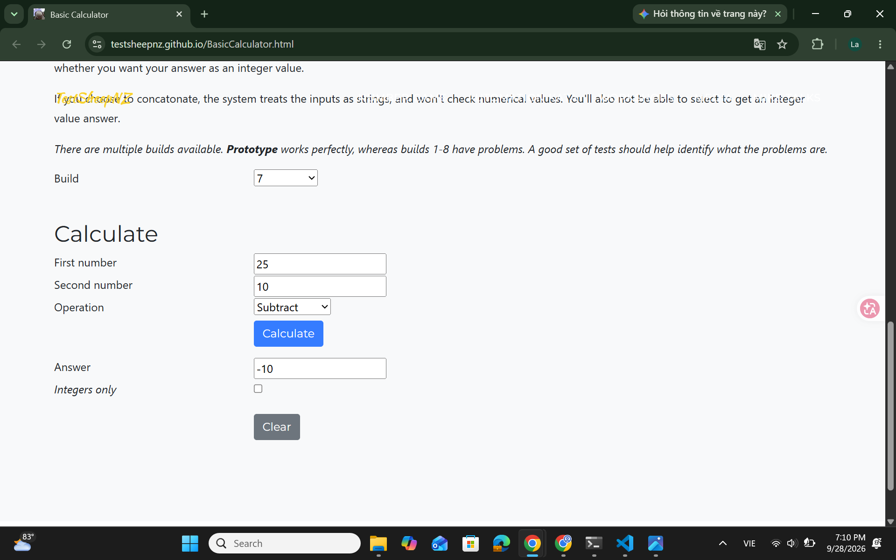

# [BUG][Subtraction][Build 7] First operand is ignored during subtraction

## GitHub Issue
[#4](https://github.com/Notistris/Ktpm-cs10003-week03/issues/4)

## Found by Test Case
- TC-SUB-001
- TC-SUB-002
- TC-SUB-003
- TC-SUB-005
- TC-SUB-006
- TC-SUB-007
- TC-SUB-008
- TC-SUB-009

## Requirement liên quan
- FR-SUB-01
- FR-SUB-02
- FR-SUB-03

## Severity / Priority
Major / P1

## Environment
- Browser: Google Chrome 153.0.8010.53
- OS: Windows 11 (10.0.26100.0)
- URL: https://testsheepnz.github.io/BasicCalculator.html
- Calculator build: 7
- Test repository commit: `9f671d7`

## Steps to reproduce
1. Open the Basic Calculator page
2. Select Build `7`
3. Enter `25` in **First number**
4. Enter `10` in **Second number**
5. Select `Subtract`
6. Click **Calculate**

## Expected result
The calculator subtracts the second operand from the entered first operand and displays `15`.

## Actual result
The calculator ignores the entered first operand and displays `-10`. The same behavior causes eight subtraction test cases to fail, including decimal, integer-only, and first-operand validation scenarios.

## Evidence
- [Build 7 test-run report](../../test-runs/subtraction/subtraction-build-7-test-run.md)
- TC-SUB-001 expected result: `Answer: 15`
- TC-SUB-001 actual result: `Answer: -10`
- Eight affected test cases are recorded in the linked test run

### Screenshot

