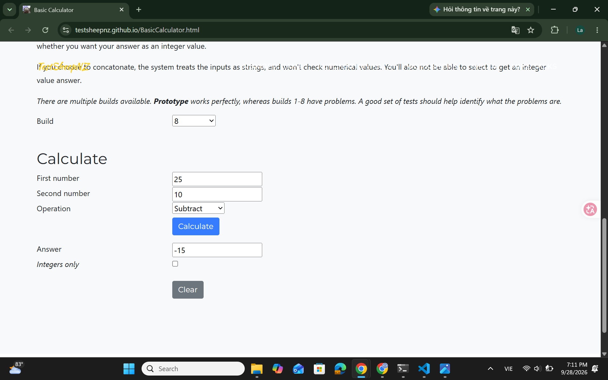

# [BUG][Subtraction][Build 8] First and second operands are reversed

## GitHub Issue
[#5](https://github.com/Notistris/Ktpm-cs10003-week03/issues/5)

## Found by Test Case
- TC-SUB-001
- TC-SUB-002
- TC-SUB-004
- TC-SUB-005
- TC-SUB-006
- TC-SUB-007
- TC-SUB-008
- TC-SUB-009
- TC-SUB-010

## Requirement liên quan
- FR-SUB-01
- FR-SUB-02
- FR-SUB-03

## Severity / Priority
Major / P1

## Environment
- Browser: Google Chrome 153.0.8010.53
- OS: Windows 11 (10.0.26100.0)
- URL: https://testsheepnz.github.io/BasicCalculator.html
- Calculator build: 8
- Test repository commit: `9f671d7`

## Steps to reproduce
1. Open the Basic Calculator page
2. Select Build `8`
3. Enter `25` in **First number**
4. Enter `10` in **Second number**
5. Select `Subtract`
6. Click **Calculate**

## Expected result
The calculator evaluates `25 - 10` and displays `15`.

## Actual result
The calculator evaluates the operands in reverse order and displays `-15`. Validation errors also reference the opposite input field. Nine subtraction test cases fail because of the reversed operands.

## Evidence
- [Build 8 test-run report](../../test-runs/subtraction/subtraction-build-8-test-run.md)
- TC-SUB-001 expected result: `Answer: 15`
- TC-SUB-001 actual result: `Answer: -15`
- Nine affected test cases are recorded in the linked test run

### Screenshot

